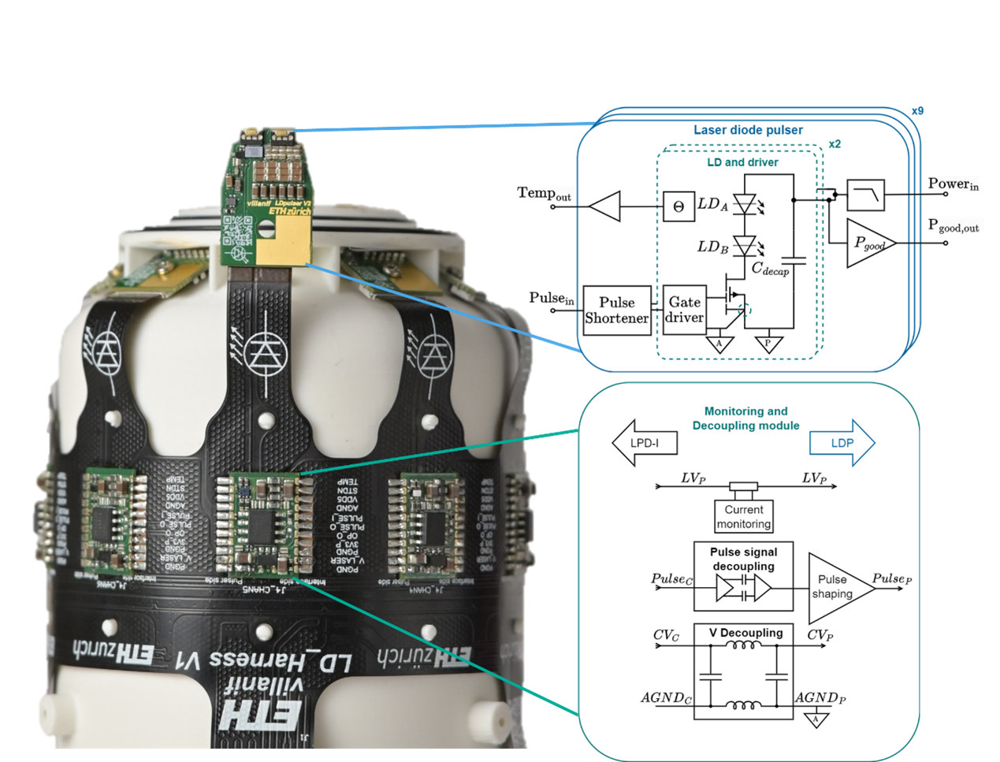

# HELIOS-R

## Handheld Embedded Laser diode Illumination for Optoacoustic – Ring shaped



## Introduction

This repository contains the electronics design files for the HELIOS-R (Handheld Embedded Laser diode Illumination for Optoacoustic – Ring shaped) system. Helios-R is a high-current laser diode pulser array capable of delivering synchronized 100 ns light pulses at peak currents up to 2.88 kA at 22V, with a total light energy emission of up to 18 kW for up to 200 ns pulse widths.

The system drives a total of 144 laser diodes (9 pulser PCBs with 4 laser modules containing 4 laser diodes each) for optoacoustic imaging applications, featuring nanosecond-scale pulse generation with minimal electromagnetic interference in a compact, portable form factor.

## System Features

- **High-Current Pulsing**: 320 A per module, 2.88 kA total peak current capability
- **Nanosecond Timing**: Pulse shortening and pulse synchronization circuits for accurate timing control
- **Low EMI Design**: Advanced decoupling and filtering for minimal electromagnetic interference
- **Modular Architecture**: 9 independent pulser modules with monitoring and control

## System Architecture

The HELIOS-T electronics comprise four main PCB modules designed for optoacoustic imaging applications:

### Core Modules

1. **Laser Diode Pulser** (`ld_pulser`): High-current dual-channel GaN FET-based pulser with 4 laser diode modules, delivering 320 A at 22V pulse current. 
2. **Interconnect Harness** (`ld_harness`): Flexible PCB harness connecting all 9 pulsers with mechanical alignment and power distribution
3. **Monitoring & Decoupling** (`ld_monitoring_decoupling`): PI filter-based decoupling modules reduce EMI, featuring digital isolation and high-side current monitoring
4. **System Control** (`ld_system_control`): Interface PCB providing access to real-time monitoring of pulse duration, current consumption, and temperature


### Development & Testing

1. **Pulser Test Board** (`ld_pulser_testboard`): Standalone testing platform for pulser validation

## Repository Structure

This repository is organized as follows:

```text
HELIOS-R/
├── ld_pulser/                    # High-current laser diode pulser module
├── ld_system_control/           # Main system control unit
├── ld_monitoring_decoupling/    # Monitoring and signal conditioning
├── ld_harness/                 # Interconnection harness
├── ld_pulser_testboard/       # Standalone pulser test platform
├── shared/                   # Shared component libraries
│   └── lib/                 # Schematic and PCB component libraries
├── 3d_models/               # 3D models and mechanical assemblies
│   └── multiboard_assembly/ # Complete system 3D assembly
└── HELIOS_R.DsnWrk          # Altium Designer workspace file
```

each pcb module folder is structured as follows:
```
   ├── Hardware/                # PCB design files
   ├── Draftsman/               # Assembly and manufacturing drawings
   ├── Documentation/           # Schematics, assembly docs, and manufacturing files
   ├── Settings/                # Output job and BOM configurations
   └── <module_name>.PrjPcb     # Altium Designer PCB project file
```

## Key Specifications

- **Operating Voltage**: 22 V high-power rail
- **Operating Current**: Peak draw of 2A per module 
- **Peak Current**: 320 A per pulser module (Decoupled and filtered on each pulser module to obtain maximum draw of 2A per module)
- **Pulse Width**: 10-200 ns with 10 ns rising edge. Pulse shortening circuits shorten the pulse width by approximately 100ns
- **Pulse repetition Frequency**: Up to 10 kHz, depending on temperature and pulse width
- **PCB Specifications summary**:  
  - ld_pulser module: 6-layer, 1 mm thick with 70 µm copper planes and blind vias
  - ld_system_control: 6-layer, 1.2 mm thick
  - ld_harness: 2 layer flexible PCB
  - ld_monitoring_decoupling: 4-layer, 1 mm thick
- **EMI Suppression**: >120 dB attenuation (150 kHz - 280 MHz) via PI filtering
- **Decoupling Network**: 60 capacitors per module (47 nF, 2.2 µF, 10 µF stages)

## Getting Started

### Prerequisites for Development

- Altium Designer (recommended version 24.0 or later)

### Viewing the Design Files

1. **Open the workspace**:

   ```text
   Open HELIOS_R.DsnWrk in Altium Designer
   ```

2. **Navigate the projects**:
   - Each subsystem is organized as a separate Altium project
   - Hardware files contain schematics (.SchDoc) and PCB layouts (.PcbDoc)
   - Draftsman files contain assembly drawings and other information (.PCBDwf)

3. **Generate documentation**:
   - Use the provided OutJob files in each Settings folder
   - Generate PDFs, Gerber files, and BOMs as needed

## Manufacturing and Assembly

### PCB Fabrication

Each module includes complete manufacturing data:

- **Gerber Files**
- **Drill Files**
- **Pick & Place**: Component placement data for assembly
- **Bill of Materials (BOM)**


## Documentation

Comprehensive documentation is generated for each module:

- **Schematics**: Complete electrical schematics in PDF format
- **<project>_FULL_DOC.pdf**: Schematic, Fabrication and assembly instructions and component placement
- **Manufacturing Files**: fabrication and assembly data packages
- **BOMs**: Bill of materials with supplier information

Access documentation in the `Documentation/` folder of each project.

## Testing and Validation

Using the Pulser test board, pulsers can be tested individually by connecting them with a standard 18 pin, 0.5 mm pitch FPC cable.

## Safety Considerations

⚠️ **WARNING**: This system delivers extremely high energy light pulses. The system can only be operated in a laser-safe environment by safety-trained personnel. Exercise extreme caution and always follow safety protocols.
Please take note of the limitation of liability below [LIMITATION OF LIABILITY](#Limitation-of-Liability)

## Usage

1. connect a 22V, minimum 2A power supply (higher current required for faster pulse rates) to the banana plugs J6 and J5 on the back of the System Control module
2. Connect a 5V power supply to screw connector J10
3. Connect a signal generator (50 ohm, V_low = 0V, V_high = 5V) to the SMA connector J9 on the System Control module
4. Set a pulse width of 110 ns - 300 ns (the pulse width is shortened by approximately 100 ns by the pulse shortening circuit)
5. Set the pulse repetition frequency

The system can operate with a Laser diode supply voltage of up to 24V. It is reccomended to first enable the 5V power supply, then the Laser diode supply. 

## Contributing

This is an open hardware project. Contributions are welcome in the form of:

- Design improvements and optimizations
- Documentation enhancements
- Bug reports and fixes

## License

This project is released the Solderpad v0.51 open hardware license. See individual license files for specific terms:

- **Hardware Design Files**: Solderpad v0.51 (`SHL-0.51`) (see `LICENSE`)
- **Documentation and images**: Creative Commons Attribution 4.0 International License (`CC-BY-4.0`) (see `docs/LICENSE_CC`):

## Authors and Acknowledgments

The HELIOS-R PCB System was developed by the IIS laboratory at ETH Zurich by Federico Villani (System architecture, simulation, design and layout), based on requirements and the concept of handheld optoacoustic imaging by Xiang Liu and Prof. Daniel Razansky. 

The PCB system is part of a wider effort, the paper **Laser diode-based large-scale compounding handheld volumetric optoacoustic tomography**, with following summarized contributions (for the full list of contributions, please refer to the paper): 

- **Xiang Liu**:  Conceptualization, methodology, investigation, experimentation, software & data analysis, visualization, writing
- **Federico Villani**: PCB system design, methodology, investigation, writing
- **Isaac Esteban Varela**: Software & data analysis
- **Xuyang Chang** & **Baoyuan Zhang**: Investigation, experimentation
- **Andrea Cossettini**: Investigation, writing
- **Xose Luis Dean-Ben**: Software & data analysis, writing  
- **Luca Benini** & **Daniel Razansky**: Conceptualization, project administration, supervision, writing

**TODO ADD citation**

Pictures of the system by: Federico Villani, Sergei Vostrikov, Xiang Liu.

## Contact and Support

For technical questions or design collaboration inquiries:

- Open an issue in this repository for technical discussions
- Contact us for collaboration opportunities

## Limitation of Liability

In no event and under no legal theory, whether in tort (including negligence), contract, or otherwise, unless required by applicable law (such as deliberate and grossly negligent acts) or agreed to in writing, shall any Contributor be liable to You for damages, including any direct, indirect, special, incidental, or consequential damages of any character arising as a result of this License or out of the use or inability to use the Work (including but not limited to damages for loss of goodwill, work stoppage, computer failure or malfunction, or any and all other commercial damages or losses), even if such Contributor has been advised of the possibility of such damages.
